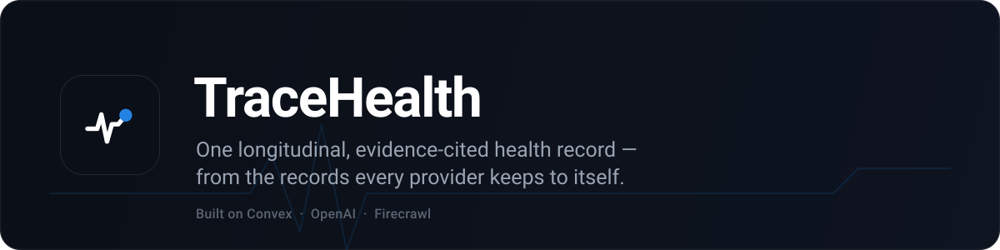

<p align="center">
  
</p>

<p align="center">
  <a href="https://ideal-swan-48.convex.site"></a>
</p>

<p align="center">
  
  
  
  
</p>

## The problem

Your medical history is scattered. Every doctor, lab, and hospital keeps its own
copy, locked in its own portal. No one — not even you — has the whole picture.

**TraceHealth pulls it all into one health history you actually own** — and puts an
AI on top that answers questions about your health and backs up every claim with the
record it came from.

> 🏆 Built for the **Convex All Gas Hackathon**.
>
> **Try it now →** open the [live demo](https://ideal-swan-48.convex.site), click
> **“Try it — no signup”**, and a 30-second tour shows you around.

---

## What you can do

- **Connect a provider.** Log in through your provider (SMART on FHIR) and your labs,
  meds, conditions, visits, and allergies sync in automatically.
- **See your whole story.** A clean timeline, trend charts with normal-range lines,
  and before/after comparisons across the years.
- **Trust every number.** Click any value to see the exact document it came from.
- **Just ask.** Chat with an AI about your health (`⌘J`). It answers with your real
  data, shows charts, cites its sources, and even looks up **live drug prices** on the
  web — and it never makes numbers up.
- **Drop in a lab report.** Paste or upload a photo/PDF in chat; the AI reads it,
  adds the results to your record, and explains what they mean.
- **Get a summary.** Pick what to include (and which graphs), and TraceHealth writes a
  clean summary in the background, pings you when it’s ready, and exports it to **PDF**.
- **Share with a doctor.** Hand any clinician a read-only snapshot with one link — no
  account needed on their end.

---

## Try it in 30 seconds

1. Open **[the live demo](https://ideal-swan-48.convex.site)**.
2. Click **“Try it — no signup”** (creates a private guest record).
3. Go to **Connections → SMART Health IT Sandbox → Connect** and log in — a full
   sample record syncs in.
4. Open **Ask AI** and try *“How is my cholesterol trending?”* or
   *“How much does atorvastatin cost?”*

---

## Under the hood

TraceHealth runs almost entirely on **[Convex](https://convex.dev)** — the database,
the backend functions, live updates, background jobs, scheduled reports, file storage,
login, *and* the website hosting all live there.

- **Convex** — everything reactive: the UI updates itself, heavy work (imports, exports,
  summaries) runs as background jobs, and the app is even hosted on Convex at `.convex.site`.
- **OpenAI** — `gpt-4o` reads scanned lab PDFs into structured data and powers the
  assistant that reasons over your record.
- **Firecrawl** — fetches live drug prices (GoodRx, Cost Plus) and current medical
  references, with real cited sources.

Want the detailed technical map? See **[hackathon.md](hackathon.md)**.

---

## Run it yourself

```bash
npm install

# Start the Convex backend (first run logs you in and sets things up)
npx convex dev

# Give the backend its API keys (server-side only — never in the browser)
npx convex env set OPENAI_API_KEY    sk-...
npx convex env set FIRECRAWL_API_KEY fc-...
```

Then, in a second terminal:

```bash
npm run dev:all     # backend + web app together → http://localhost:5173
```

**Deploy** (frontend + backend, both on Convex):

```bash
npx convex deploy --yes
npx @convex-dev/static-hosting upload --build --prod
```

---

## What's in the repo

```
convex/            The backend — data model, AI, FHIR sync, reports, notifications
src/               The React app — dashboard, trends, chat, reports, sharing
docs/              Product notes, PRDs, testing + demo scripts, brand assets
sample-records/    Real-format lab reports & FHIR files to test importing
```

More docs: **[Use cases](docs/USE_CASES.md)** · **[Testing guide](docs/TESTING.md)** ·
**[Product notes](docs/PRODUCT.md)**

---

<p align="center"><sub>A hackathon prototype — not a medical device. No diagnosis, prescription, or treatment advice.</sub></p>
